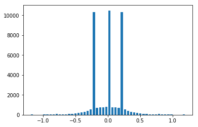

# **Behavioral Cloning** 

---

**Behavioral Cloning Project**

The goals / steps of this project are the following:
* Use the simulator to collect data of good driving behavior
* Build, a convolution neural network in Keras that predicts steering angles from images
* Train and validate the model with a training and validation set
* Test that the model successfully drives around track one without leaving the road
* Summarize the results with a written report

---

## Collecting Data

To collect the data I drove the simulation car around the track three times in the counter clockwise direction and one time in the clockwise direction.
Images were recorded from a camera on the right left and center of the dashboard and those were stored with the controls I provided to the car (steering, throttle ...). 

## Preprocessing

There were two main preprocessing steps I took. First, data augmentation, for each frame I added the flipped image along with the flipped steering angle, this ensured the model would not have a counter clock wise bias based on my training data. I also added the images from the right and left side of the hood
with a correction to the angle of 0.25 and -0.25. The other preprocessing step I took was to enhance each frames quality. I did this by converting to YUV color channels providing which made training the model easier, and I aggressively cropped the top and bottom of the frame so that only the actual road was being processed in the network. 

## Generator

This left only one big problem with my data. The vast majority of data had an output value of 0 because often I was not actively turning the stearing wheel. This ultimately was the problem I struggled with most. 

Because not turning dominated the training dataset the model could achieve minimal loss simply by outputting each prediction close to 0 as well. The first approach I tried to fix this involved selectively removing data to try and reshape my data into a normal curve. This was effective and able to successfully navigate the track, but took a large amount of time because all the data needed to be loaded and iterated over before the model could start training. I wanted to use a generator so pre analyzing all of my data was not an option. 

My next approach involved simply adding a tiny weight on all training data that had a steering angle of 0 attached to it. From looking at the above chart the 0 angle data looks over represented by about 10 times. In hindsight adding a weight of .1 would have probably been a good approach; however, I attached a weight of 0.01 to this data. This left me with a model that was a little bit prone to oversteering. 

## Other Approaches

Other things I could have tried was changing the loss function to penalize the understeering more heavily. Instead of using mean squared error I could have used mean cubed error. This would ensure that the model would not keep all predictions as close to zero. 

## The Model

I did very little in terms of tinkering with the model. I simply used a model similar to Nvidias model for self driving cars. This model was probably to big
for the data with just over 900,000 parameters, but I figured it would still be alright. I did not find regularization or dropout to be particularly helpful when training and I kept my number of epochs low to avoid over fitting. 

Layer (type)                     Output Shape          Param #     Connected to                     
====================================================================================================
cropping2d_1 (Cropping2D)        (None, 90, 320, 3)    0           cropping2d_input_1[0][0]         
____________________________________________________________________________________________________
lambda_1 (Lambda)                (None, 90, 320, 3)    0           cropping2d_1[0][0]               
____________________________________________________________________________________________________
convolution2d_1 (Convolution2D)  (None, 43, 158, 24)   1824        lambda_1[0][0]                   
____________________________________________________________________________________________________
convolution2d_2 (Convolution2D)  (None, 20, 77, 36)    21636       convolution2d_1[0][0]            
____________________________________________________________________________________________________
convolution2d_3 (Convolution2D)  (None, 8, 37, 48)     43248       convolution2d_2[0][0]            
____________________________________________________________________________________________________
convolution2d_4 (Convolution2D)  (None, 6, 35, 64)     27712       convolution2d_3[0][0]            
____________________________________________________________________________________________________
convolution2d_5 (Convolution2D)  (None, 4, 33, 64)     36928       convolution2d_4[0][0]            
____________________________________________________________________________________________________
flatten_1 (Flatten)              (None, 8448)          0           convolution2d_5[0][0]            
____________________________________________________________________________________________________
dense_1 (Dense)                  (None, 100)           844900      flatten_1[0][0]                  
____________________________________________________________________________________________________
dense_2 (Dense)                  (None, 50)            5050        dense_1[0][0]                    
____________________________________________________________________________________________________
dense_3 (Dense)                  (None, 10)            510         dense_2[0][0]                    
____________________________________________________________________________________________________
dense_4 (Dense)                  (None, 1)             11          dense_3[0][0]                    

Total params: 981,819
Trainable params: 981,819
Non-trainable params: 0
____________________________________________________________________________________________________

## What next?

In the end I spent a lot of time working on two separate models. One did very well on the straights but could not turn sharply enough to complete the track. The other model could turn very well, but would often oversteer. An addition to find a happy medium between these to models is to use an ensemble algorithm to combine the outputs of both of these models. This way I would be able to essentially use one model for driving on a straight road and another for driving on a curvy road. 

## Result

These are videos of my model driving around the simulation track. 

